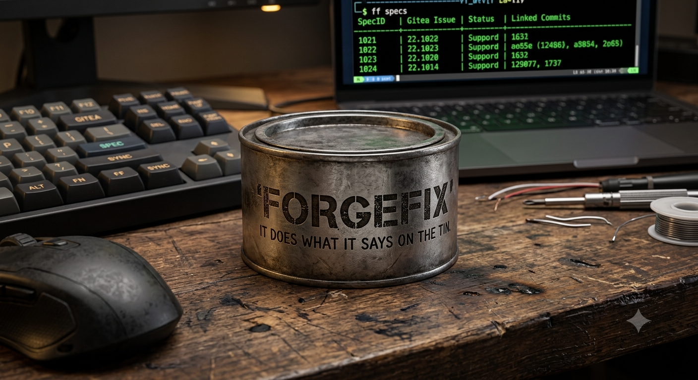

# ForgeFix

**Zero-config, Git-native spec-driven development.** ForgeFix binds local specification files to commits and remote issues — every change is traceable to a spec, every spec links to an issue, and no code ships without a paper trail.

[](https://go.dev) 



---

## Why ForgeFix?

- **Traceability built in.** Every commit is auto-tagged with its spec ID (`feat: [SPEC-1741712345] implement the thing`). The local ledger maps specs to commits and remote issues.
- **No database, no server.** A lightweight JSON ledger (`.ff/forgefix_ledger.json`) tracks everything. Check it into your repo for portable history.
- **Paperclip integration.** Optional Paperclip AI integration for agent-team orchestration, goal alignment, and cost controls (see [Paperclip Integration](#paperclip-integration)).
- **Forget skills, remember one thing: ForgeFix.** Agents waste context juggling skill files — CORS rules, deployment checklists, commit conventions. ForgeFix tracks everything: spec→commit→issue→ship. One command, one paper trail. No skill file needed. See [ForgeFix for AI Agents](#forgefix-for-ai-agents).
- **Strict Shipping Gate.** `ff ship` rejects the release if any spec is still `backlog`, `in-progress`, or `review` — only `ship`-status specs pass.
- **Multi-language test runner.** ForgeFix auto-detects your project (Go, Rust, Python, Node, Flutter, and 12+ more) and runs tests with a real-time TUI dashboard.
- **AI-native.** `--ai` flag emits structured JSON for headless / AI-supervised pipelines.
- **Just a binary.** Drop `ff` in your PATH and you're ready. No dependencies, no containers, no orchestration.

---

## Installation

### From source

```bash
go build -o ff .
```

### Global install

```bash
ff --install
```

Copies the binary to `~/.local/bin/ff` and adds it to your PATH. Restart your shell or run `source ~/.zshrc` (or `~/.bashrc`) afterward.

---

## Quick Start

```bash
# 1. Create a spec
ff spec my-feature

# 2. Write code, then commit with the spec bound
ff commit -s SPEC-1741712345 "implement the thing"

# 3. Sync local specs to remote issue tracker
ff sync

# 4. List active specs and their status
ff specs

# 5. Ship — only succeeds if all specs are in 'ship' status
ff ship
```

No configuration needed beyond a single `<project>_ff.yaml` in your project root. ForgeFix auto-generates one on first run — the filename always matches the project folder name so it can be discovered from subdirectories.

---

## Spec Lifecycle

A spec progresses through these statuses:

| Status         | Description |
| -------------- | ----------- |
| `draft`        | Newly created, not yet actionable |
| `backlog`      | Ready to work on |
| `in-progress`  | Work has started (set via `ff backlog` → advance, or manually) |
| `review`       | Ready for feedback |
| `ship`         | Approved — passes the Shipping Gate |
| `closed`       | Shipped (auto-set after `ff ship` succeeds) |

Change a spec's status by editing the `status` field in its YAML frontmatter (`specs/<name>.md`).

---

## Commands

### `ff spec <name>`

Creates a new spec file from the template in `templates/spec_template.md`. Generates a unique `SPEC-<timestamp>` ID, registers it in the ledger with `draft` status, then opens the file in `$EDITOR` (defaults to `vim`).

```bash
ff spec my-feature
ff spec fix-login-bug
```

**Duplicate detection:** If a spec with a similar title already exists, ForgeFix prompts you to link to the existing spec, update it, or create a new one with a `[Dupe]` suffix.

### `ff spec --delete <spec-id>`

Removes the spec from the ledger, deletes its file from `specs/`, and queues a remote issue deletion.

```bash
ff spec --delete SPEC-1741712345
```

### `ff commit [message]`

Stages all changes and creates a commit with the message formatted as `feat: [SPEC-XXX] <message>`. Records the commit hash in the ledger and advances the spec status to `review`.

**Spec selection (interactive):** If you omit `-s`, ForgeFix shows a categorized menu (Feature / Bug / Refactor / All) to pick the spec.

```bash
ff commit -s SPEC-1741712345 "add user authentication"
ff commit                          # interactive picker
ff commit -s SPEC-1741712345 --type bug --ver 1.1   # set metadata
```

**Commit flags:**

| Flag | Description |
| ---- | ----------- |
| `-s, --spec <id>` | Spec ID to bind (bypasses menu) |
| `-t, --type <type>` | Set spec type label (`feature`, `bug`, `refactor`) |
| `--ver <version>` | Set spec version label |
| `-m, --message <msg>` | Supply message inline (non-interactive) |

### `ff specs`

Lists all active specs in a table with SpecID, remote issue number, colorized status, and linked commit hashes.

```bash
ff specs          # active only
ff specs --all    # include closed/resolved specs
```

### `ff sync [path]`

Scans local spec files and creates or updates corresponding issues on the remote tracker (Gitea or GitHub). Requires `github` credentials in your `<project>_ff.yaml`.

```bash
ff sync
ff sync /path/to/project
```

### `ff ship [path]`

**Strict Shipping Gate.** Checks every active spec: if any is `backlog`, `in-progress`, or `review`, the ship is aborted with a listing. On success, it pushes commits, runs final verification, and transitions shipped specs to `closed` via housekeeping.

```bash
ff ship
ff ship /path/to/project
```

### `ff archive`

Combines all `resolved`-status spec files into a single timestamped archive document (`archive_YYYYMMDD.md`) in the `specs/` directory. Resolved spec files are left in place.

```bash
ff archive
# → Archived 3 resolved specs to specs/archive_20260616.md
```

### `ff version`

Prints the ForgeFix version.

```bash
ff version
# → ForgeFix 0.9.0
```

### `ff help`

Prints usage information.

### `ff` (no subcommand)

Runs the project's test suite with the interactive TUI dashboard. Equivalent to invoking the configured test command for your language.

---

## Running Tests

### Interactive mode (default)

```bash
ff
```

Displays a real-time TUI dashboard with colored pass/fail per test, elapsed time, pipeline status, and error details.

### AI / headless mode

```bash
ff --ai
```

Emits structured JSON events to stdout — designed for CI pipelines and AI-supervised execution.

### Filter tests

```bash
ff -r TestFoo        # run only tests matching "TestFoo"
ff -r TestAuth       # run only auth-related tests
```

### Override failure decay

```bash
ff -d 300            # 5-minute decay window (suppresses flaky-test issues)
```

---

## Configuration

ForgeFix generates a `<project_name>_ff.yaml` file on first run. For a project in `myapp/`, it creates `myapp_ff.yaml`.

**Why the folder name matters.** ForgeFix discovers its config by looking for `<folder_name>_ff.yaml` in the current directory, then falls back to any `*_ff.yaml` file, then scans subdirectories one level deep. This naming convention lets `ff` find the right config when you run it from any subdirectory inside the project.

```yaml
global_timeout_seconds: 120
failure_decay_seconds: 30
auto_issue_management: true  # auto-create/close issues in --ai mode

github:
  owner: "my-org"
  repo: "myapp"
  token: "ghp_..."           # personal access token
  base_url: "https://api.github.com"  # or Gitea: http://host:3000/api/v1

pipelines:
  - id: myapp
    name: "[myapp]"
    type: go_mod              # matches a key under languages:
    panel_color: blue
    timeout_seconds: 300

languages:
  go_mod:
    root_anchor: go.mod
    test_command: go test -json ./...
    token_patterns:
      token_run: '"Action":"run"'
      token_pass: '"Action":"pass"'
      token_fail: '"Action":"fail"'
    panel_color: blue
    timeout_seconds: 300
```

### Supported languages

ForgeFix auto-detects your project from these anchor files:

| Anchor              | Language / Stack | Default test command |
| ------------------- | ---------------- | -------------------- |
| `go.mod`            | Go               | `go test -json ./...` |
| `pubspec.yaml`      | Flutter / Dart   | `flutter test --machine` |
| `package.json`      | Node.js          | `npm test -- --json 2>/dev/null` |
| `Cargo.toml`        | Rust             | `cargo test -- --format=json 2>/dev/null` |
| `Gemfile`           | Ruby             | `bundle exec rspec --format json 2>/dev/null` |
| `setup.py` / `pyproject.toml` | Python  | `python -m pytest --json-report 2>/dev/null` |
| `pom.xml`           | Java (Maven)     | `mvn test 2>&1` |
| `build.gradle`      | Java (Gradle)    | `./gradlew test 2>&1` |
| `mix.exs`           | Elixir           | `mix test 2>&1` |
| `composer.json`     | PHP              | `composer test 2>&1` |
| `CMakeLists.txt`    | C / C++          | `ctest --output-on-failure 2>&1` |
| `Makefile`          | Generic Make     | `make test 2>&1` |
| `Rakefile`          | Ruby (Rake)      | `rake test 2>&1` |
| `cabal.project`     | Haskell          | `cabal test 2>&1` |
| `Package.swift`     | Swift            | `swift test 2>&1` |
| `project.json`      | .NET             | `dotnet test --logger:json 2>/dev/null` |
| `deno.json`         | Deno             | `deno test --reporter=json 2>/dev/null` |
| `bun.lock`          | Bun              | `bun test --reporter=json 2>/dev/null` |

Add additional entries under `languages:` to support custom setups.

### Config reference

| Field | Default | Description |
| ----- | ------- | ----------- |
| `global_timeout_seconds` | `120` | Max time for the entire test suite |
| `failure_decay_seconds` | `30` | Time window for suppressing flaky-test issues |
| `auto_issue_management` | `false` | Auto-create/close remote issues in `--ai` mode |
| `github.base_url` | `https://api.github.com` | API endpoint (GitHub or Gitea) |
| `sync_schedule.max_age_days` | `7` | Max age before re-syncing a spec |
| `sync_schedule.retry_interval_hours` | `1` | Delay between sync retries |

---

## The Ledger

ForgeFix stores spec state in `.ff/forgefix_ledger.json` — a plain JSON file that maps spec IDs to their status, linked commits, and remote issue IDs. Check it into version control to share spec history across your team.

```json
{
  "version": "0.9.0",
  "entries": {
    "SPEC-1741712345": {
      "spec_id": "SPEC-1741712345",
      "status": "in-progress",
      "repo_issue_id": 42,
      "linked_commits": ["a1b2c3d4..."],
      "type": "feature",
      "version": "1.0",
      "created": "2026-06-16"
    }
  }
}
```

---

## Spec File Format

Spec files are plain Markdown with YAML frontmatter, stored in `specs/`.

```markdown
---
spec_id: "SPEC-1741712345"
status: backlog
type: feature
version: "1.0"
repo_issue: "42"
created: 2026-06-16
---

# My Feature

## Goal

What this feature accomplishes.

## Technical Requirements

- Requirement one
- Requirement two

## Acceptance Criteria

- [ ] Criterion one
- [ ] Criterion two
```

### Frontmatter fields

| Field | Required | Description |
| ----- | -------- | ----------- |
| `spec_id` | Yes | Auto-generated unique ID (`SPEC-<unix-timestamp>`) |
| `status` | Yes | Current lifecycle status |
| `type` | No | Category: `feature`, `bug`, `refactor` |
| `version` | No | Semver label for release tracking |
| `repo_issue` | No | Remote issue ID (set by `ff sync`) |
| `created` | Yes | Creation date |

---

## Architecture

```
project/
├── specs/              # Spec files (*.md)
│   ├── my-feature.md
│   ├── fix-login.md
│   └── archive_20260616.md
├── templates/
│   └── spec_template.md
├── .ff/
│   └── forgefix_ledger.json   # Spec state and commit mappings
├── myapp_ff.yaml              # Pipeline configuration
└── ff                         # Compiled binary
```

ForgeFix is a single binary with no runtime dependencies. The ledger is a JSON file. Specs are plain Markdown. Everything is git-friendly and portable.

---

## Remote Sync

ForgeFix syncs local spec status to Gitea or GitHub issues.

1. Configure `github` in your `<project>_ff.yaml` with your endpoint and token.
2. Run `ff sync` — ForgeFix creates or updates issues to match spec bodies and status.
3. `ff sync` is also triggered automatically after `ff commit` when credentials are configured.
4. Failed background syncs are stored and retried on next run. ForgeFix prompts you on startup if failures are pending.

---

## AI Mode

The `--ai` flag switches ForgeFix to machine-readable JSON output for headless operation.

```bash
ff --ai                     # run tests, JSON output
ff --ai --run TestFoo       # run specific test, JSON output
ff spec my-feature --ai     # create spec without opening editor
```

In AI mode:
- Output is line-delimited JSON events
- Test results include structured pass/fail with error traces
- The spec editor is skipped (spec is created silently)
- Duplicate detection defaults to linking rather than prompting

---

## ForgeFix for AI Agents

**Skills are dead. Long live ForgeFix.**

AI agents waste context juggling skill files — CORS rules, deployment checklists,
commit conventions, framework-specific workflows. Every new project means another
skill to load, another file to remember. ForgeFix replaces all of it.

With ForgeFix, an agent only needs to remember one thing:

```
ff spec --ai <title>     → define the work
ff commit --ai <msg>     → bind commits to specs (auto-detect)
ff sync --ai             → sync to remote, promote to ship
ff ship --ai             → push, close, release
ff archive --ai          → archive completed specs
```

That's it. The spec file is the skill. The `[SPEC-XXX]` tag in every commit
message is the paper trail. The Shipping Gate is the checklist. No separate
skill document to load, no conventions to memorize — they're encoded in the
specs and enforced by the gate.

ForgeFix handles the gritty details agents always forget:
- **Commit conventions.** `ff commit --ai` auto-formats
  `feat: [SPEC-XXX] <message>` — agents never memorize conventional commits.
- **Status tracking.** Draft → Review → Ship → Closed — the spec file tracks
  it, the ledger persists it, `ff sync` advances it.
- **Remote sync.** `ff sync` creates/updates remote issues with the spec body.
  Agents don't need to know the API endpoints.
- **Release creation.** `ff ship --ai` tags, pushes, and creates a Gitea/GitHub
  release. Agents don't need to know the release API.
- **Self-update.** `ff version --update` downloads the latest binary from the
  NAS Gitea releases. The agent doesn't need to know the download URL.
- **SQLite storage.** Specs and pipeline stats are moving to `.ff/forgefix.db`.
  The agent never manages files directly.
- **Storage backend.** `spec_storage` config (file/sqlite/both) lets the agent
  choose without touching infrastructure.

The `forgefix-git-workflow` skill in `skills/` exists as a reference, but the
agent doesn't need to load it. `ff` is the only tool an agent needs.

---

## Development

```bash
# Build
go build -o ff .

# Run tests
go test ./... -v

# Run tests with ForgeFix itself
ff
```

### Building from source

Requires Go 1.26.2 or later.

```bash
git clone <repo-url>
cd forgefix
go build -o ff .
./ff version
```

### Project structure

- `main.go` — CLI entry point and command dispatcher
- `engine/` — Core logic: ledger, sync, ship, commit, test runner, dashboard, watcher, archive
- `engine/housekeeper/` — Resolution payload queue processing
- `specs/` — Spec files (created by `ff spec`)
- `templates/` — Spec template for `ff spec`

---

## Troubleshooting

| Problem | Likely cause | Fix |
| ------- | ------------ | --- |
| `<project>_ff.yaml not found` | No config file in project root | Run `ff spec` or `ff commit` to auto-generate one — filename must match the project folder name |
| Sync fails silently | Missing GitHub token or wrong endpoint | Check `github.token` and `github.base_url` in your `<project>_ff.yaml` |
| Ship rejected | One or more specs not in `ship` status | Run `ff specs` to see which specs need promotion |
| `go: not found` | Test runner couldn't find Go | Install Go or configure a different test command in `<project>_ff.yaml` |
| `ff: command not found` after install | `~/.local/bin` not in PATH | Restart shell or run `source ~/.zshrc` (`~/.bashrc`) |

---

## Paperclip Integration

ForgeFix now includes **optional integration with Paperclip AI**, an autonomous agent orchestration platform. This integration is completely optional and does not affect ForgeFix's core functionality.

### Why Integrate with Paperclip?

ForgeFix and Paperclip complement each other:

| ForgeFix | Paperclip |
|----------|-----------|
| Issue tracking and sync with GitHub | Agent team orchestration |
| Test pipeline execution | Business goal alignment |
| Spec definitions | Agent roles and responsibilities |
| Ledger and audit trail | Full conversation tracing |
| Cost tracking (test time) | Per-agent budget control |

### Key Features

1. **Unified Workflow**: Map ForgeFix specs to Paperclip goals
2. **Agent-Assisted Testing**: Use Paperclip agents to run ForgeFix tests
3. **Business-Context**: Align technical specs with business objectives
4. **Cost-Aware**: Track development costs alongside test costs
5. **Governance**: Board-level control over agent teams and development pipeline

### Usage

```bash
# Basic ForgeFix (no Paperclip)
ff
ff spec my-feature
ff sync

# With Paperclip integration
ff paperclip status
ff paperclip setup
ff --paperclip
```

### CLI Commands

| Command | Description |
|---------|-------------|
| `ff paperclip` | Interactive Paperclip integration setup and management |
| `ff --paperclip` | Run ForgeFix with Paperclip integration enabled |
| `ff paperclip sync` | Manually trigger ForgeFix-Paperclip sync |
| `ff paperclip status` | Check integration status and connectivity |

### Configuration

Paperclip integration is enabled in your `<project>_ff.yaml`:

```yaml
# <project>_ff.yaml
paperclip:
  enabled: false             # Enable Paperclip AI integration
  auto_setup: true
  sync_direction: bi-directional
  team_id: "my-forgefix-team"
  api_endpoint: "https://api.paperclip.ing"
```

### Data Flow

```
Paperclip Goals → ForgeFix Specs → Tests → Results
```

## Agent Skills

ForgeFix includes the following agent skills for different use cases:

### `forgefix-git-workflow`

A comprehensive guide for using ForgeFix in development workflows, replacing raw git operations with the spec-driven lifecycle: `ff spec → ff commit → ff sync → ff ship → ff archive`.

**Key Features:**
- Auto-detect spec from working tree
- No raw `git` commands (all through `ff` passthrough)
- AI mode support for headless operations
- Full lifecycle documentation
- Integration with Paperclip for agent orchestration

### `forgefix-git-workflow-agent`

A short, agent-focused variant for quick reference, containing only essential commands and lifecycle information without branching strategy or extensive reference sections.

**Key Features:**
- ~100 lines focused on essential commands
- Lifecycle and auto-detect information
- Auto-promote and verification checklist
- Red flags and critical warnings
- No branching strategy or worktree details

Both skills coexist in the repository:
- Full version: `skills/forgefix-git-workflow.md`
- Agent variant: `skills/forgefix-git-workflow-agent.md`

### Integration Examples

```bash
# Basic ForgeFix workflow
ff spec --ai "my-feature"
implement code
ff commit --ai "implement feature"
ff sync --ai
ff ship --ai
ff archive --ai

# With Paperclip for agent teams
ff --paperclip
ff spec --ai "agent-task"
ff commit --ai "agent development"
ff sync --ai
```

Each agent skill is copied to the global skill directory (`~/.agents/skills/forgefix-git-workflow/SKILL.md`) for easy access, while the agent variant remains repo-only for optional use.

## FAQ

**Q: Does ForgeFix require Gitea or GitHub?**  
No. The spec and commit workflow works entirely offline. Issue sync is optional and requires a configured endpoint.

**Q: Can I use ForgeFix with non-Go projects?**  
Yes. ForgeFix auto-detects 18+ language ecosystems from their config files (see [Supported languages](#supported-languages)).

**Q: How do I change a spec's status?**  
Edit the `status` field in the spec file's YAML frontmatter directly.

**Q: What happens if I delete a spec file?**  
The ledger still tracks it. Use `ff spec --delete <id>` for clean removal from both the filesystem and ledger.

**Q: Can I run ForgeFix in CI?**  
Yes. Run `ff --ai` for JSON output suitable for CI pipelines. The exit code reflects test suite success.

**Q: What is Paperclip integration?**  
Paperclip is an optional integration that adds agent team orchestration, goal alignment, and cost control to ForgeFix. It maps ForgeFix specs to Paperclip business goals and allows Paperclip agents to run ForgeFix tests.

**Q: Is Paperclip integration required?**  
No. Paperclip integration is completely optional and does not affect ForgeFix's core functionality. Enable it in `<project>_ff.yaml` if needed.

**Q: What happens when Paperclip is enabled?**  
ForgeFix will detect Paperclip availability and offer to configure integration when first run. The integration enables bidirectional sync between ForgeFix specs and Paperclip goals, with agent orchestration and cost tracking.

**Q: How do I use Paperclip with ForgeFix?**  
Use `ff --paperclip` to run ForgeFix with integration enabled, `ff paperclip` for setup and management commands, and `ff --ai` for headless AI mode that works with Paperclip.
